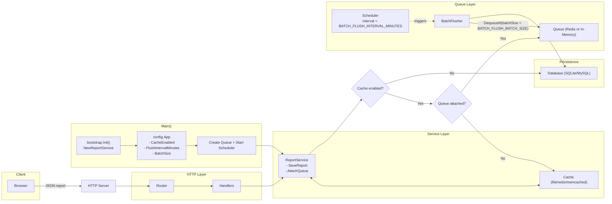

# Security Report Collector

[](https://github.com/vinsonio/security-report-collector/actions/workflows/lint.yml)
[](https://github.com/vinsonio/security-report-collector/actions/workflows/ci.yml)

Security Report Collector is a lightweight, extensible service for collecting and storing various types of security-related reports. It is designed to be easy to deploy and configure, making it a simple but powerful tool for monitoring web application security.

## Features

- **Extensible Report Handling**: Easily add support for new report types through a simple interface.
- **Multiple Storage Backends**: Supports SQLite and MySQL for storing reports, with the flexibility to add more.
- **Domain Whitelisting**: Optionally whitelist domains to restrict which domains can send reports.
- **Data Persistence**: Reports are stored in a database, with the option to use a cache for improved performance.
- **Asynchronous Processing**: Supports asynchronous report processing using a queue and batch flusher.

## Architecture Overview



Key points:
- Router/Handlers only construct HTTP routes and delegate work to ReportService.
- ReportService decides the path based on configuration: when caching is enabled and a queue is attached, reports are enqueued; otherwise they go through the legacy cache short-circuit and persist path; if caching is disabled, they go straight to the database.
- The queue can be backed by Redis (persistent) or in-memory (ephemeral), selected via CACHE_DRIVER.
- BatchFlusher runs on a scheduler with a configurable interval and batch size via BATCH_FLUSH_INTERVAL_MINUTES and BATCH_FLUSH_BATCH_SIZE.
- Application lifecycle (queue creation and scheduler startup) is owned by main(), not by router construction.

## Supported Report Types

| Report Type | Endpoint | Description |
|---|---|---|
| Content Security Policy (CSP) Violation | `/reports/csp` | Receives reports about CSP violations from browsers. |

Support for more report types, such as Certificate Transparency (`ct`) and other browser-based security reports, is planned for the future. The system is designed to be easily extended to handle any JSON-based report.

## Getting Started

These instructions will get you a copy of the project up and running on your local machine for development and testing purposes.

### Prerequisites

- Go (version 1.24 or later)
- Docker and Docker Compose (for running tests with external databases)

### Installing

1.  **Clone the repository:**

    ```sh
    git clone https://github.com/vinsonio/security-report-collector.git
    cd security-report-collector
    ```

2.  **Install dependencies:**

    ```sh
    go mod tidy
    ```

3.  **Configure your environment:**

    Copy the `.env.example` file to `.env` and update the variables to match your setup. This is especially important if you plan to use the MySQL backend.

    ```sh
    cp .env.example .env
    ```

4.  **Run the server:**

    ```sh
    go run cmd/server/main.go
    ```

The server will start on `http://localhost:8080` by default.

## Database Migrations

This project uses `golang-migrate` to manage database schema changes. Migrations are located in the `database/migrations` directory and are applied automatically when the application starts.

To create a new migration, you can use the `migrate` CLI tool. For example:

```sh
migrate create -ext sql -dir database/migrations -seq <migration_name>
```

## Running with Docker

You can also run the application using Docker and Docker Compose. This is the recommended way to run the application in production.

1.  **Build and run the container:**

    ```sh
    docker-compose up --build
    ```

2.  **File Permissions (for Linux/macOS users):**

    To avoid file permission issues with mounted volumes, you can pass your user and group ID to the build process. Create a `.env` file with the following content:

    ```
    UID=$(id -u)
    GID=$(id -g)
    ```

    Then, run `docker-compose up --build` as usual. The container will run with your user and group, ensuring correct file permissions.

## Running the tests

To run the unit tests, execute the following command:

```sh
go test ./...
```

For integration tests that require a database, you can use Docker Compose:

```bash
docker-compose up -d
go test ./...
docker-compose down
```

## API Endpoints

- `POST /reports/{report-type}`: Submits a report. Replace `{report-type}` with the type of report you are sending (e.g., `csp`).
- `GET /healthz`: Checks the health of the service.

## Testing

You can send a test CSP report using `curl`:

```sh
curl -X POST -H "Content-Type: application/json" -d \
'{
    "type": "csp-violation",
    "url": "https://example.com",
    "body": {
        "documentURL": "https://example.com",
        "disposition": "report",
        "referrer": "",
        "effectiveDirective": "font-src",
        "blockedURL": "https://fonts.gstatic.com/s/inter/v19/UcC73FwrK3iLTeHuS_nVMrMxCp50SjIa2ZL7W0Q5n-wU.woff2",
        "originalPolicy": "default-src 'self'; script-src 'self'; img-src: 'self'; report-to csp",
        "statusCode": 200,
        "sample": "",
        "sourceFile": "https://example.com",
        "lineNumber": 0,
        "columnNumber": 1
    }
}' \
http://localhost:8080/reports/csp
```

## Contributing

Contributions are welcome! Please feel free to submit a pull request or open an issue to discuss your ideas. Before contributing, please review the [CONTRIBUTING.md](CONTRIBUTING.md) file for guidelines.

## License

This project is licensed under the MIT License - see the [LICENSE](LICENSE) file for details.